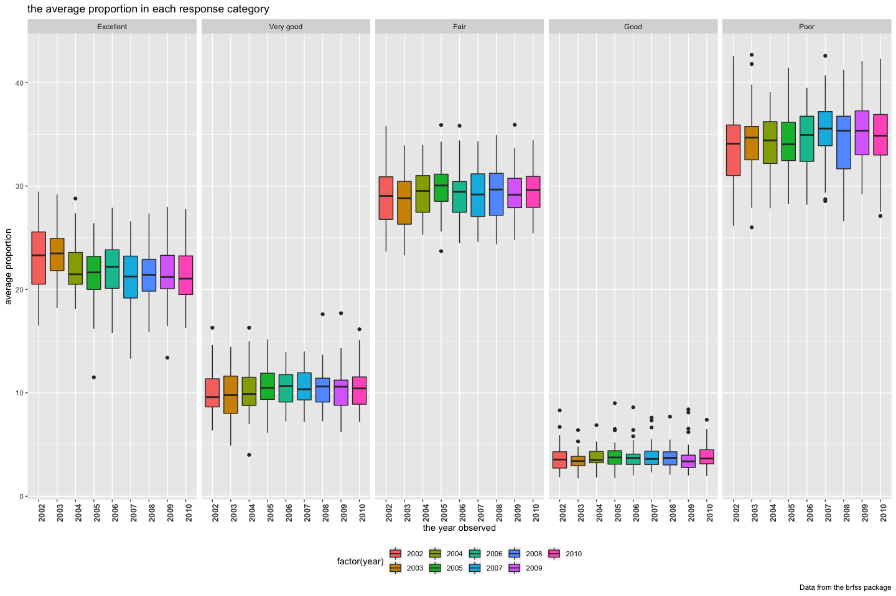

p8105\_hw3\_jx2371
================
Jingyu Xu
2018/10/13

Firstly，I set a globle option which hides the message and warning information.

``` r
knitr::opts_chunk$set(message = FALSE, warning = FALSE)
```

Problem 1
=========

data cleaning
-------------

Firstly，I did some data cleaning in this code chunck format the data to use appropriate variable names； focus on the “Overall Health” topic； include only responses from “Excellent” to “Poor”
organize responses as a factor taking levels ordered from “Excellent” to “Poor”

``` r
library(p8105.datasets)
library(tidyverse)
brfss = brfss_smart2010 %>%
  janitor::clean_names() %>%
  rename(state=locationabbr,location=locationdesc)%>%
  filter(topic == "Overall Health") %>% 
  filter(response == "Excellent"|response == "Very good"|response == "Good"|response == "Fair"|response == "Poor")%>%
  mutate(response=as.factor(response))
levels(brfss$response)=c("Excellent","Very good","Fair","Good","Poor")
```

answering questions
-------------------

1.selecting the states that were observed at 7 locations in 2002

``` r
brfss%>%
  filter(year==2002)%>%
  group_by(state,location) %>%
  summarize(n = n())%>%
  count(state)%>%
  filter(nn==7)
```

    ## # A tibble: 3 x 2
    ## # Groups:   state [3]
    ##   state    nn
    ##   <chr> <int>
    ## 1 CT        7
    ## 2 FL        7
    ## 3 NC        7

we can see from the result of the code chunk that CT,FL and NC had 7 locations observed in 2002.

2.draw a spaghetti plot showing the number of locations in each state from 2002 to 2010

``` r
brfss%>%
  group_by(state, year,location)%>%
  summarize(n=n())%>%
  group_by(state, year)%>%
  summarize(number=n())%>%
  ggplot(aes(x = year, y = number, color = state)) + 
  geom_line(size=0.3) +
  theme(legend.position = "bottom")
```

 We observe from the soaghetti plot that the trend of locations in most of the states is somehow stable, with little fluctuation. On the other hand, FL is unique in these observations that it changes dramatically by the year and reaches 40 in 2010, which is the most among all the states.

3.we can see from the dataset that the column data\_value refer to the proportion(%). To make it clear, I create a new column named "proportion" in percentage and select the data of 2002，2006 and 2010. Then, I caculate the mean and variance of the excellent data across locations in United states

``` r
excellent_data=filter(brfss,year=="2002" | year=="2006" |year=="2010",response=="Excellent",state=="NY")%>%
  select(year,state,location,response,data_value)%>%
  mutate(data_value=data_value/100)%>%
  rename(proportion=data_value)

mean_2002=mean((subset(excellent_data, year=="2002"))$proportion,na.rm = TRUE)
standard_var_2002=sqrt(var((subset(excellent_data, year=="2002"))$proportion,na.rm = TRUE))
mean_2006=mean((subset(excellent_data, year=="2006"))$proportion,na.rm = TRUE)
standard_var_2006=sqrt(var((subset(excellent_data, year=="2006"))$proportion,na.rm = TRUE))
mean_2010=mean((subset(excellent_data, year=="2010"))$proportion,na.rm = TRUE)
standard_var_2010=sqrt(var((subset(excellent_data, year=="2010"))$proportion,na.rm = TRUE))
```

now a table is create:

``` r
tibble(year=c("2002", "2006", "2010"), standard_variance=c(standard_var_2002,standard_var_2006,standard_var_2010),
                      mean=c(mean_2002, mean_2006, mean_2010))%>%
knitr::kable()
```

| year |  standard\_variance|       mean|
|:-----|-------------------:|----------:|
| 2002 |           0.0448642|  0.2404000|
| 2006 |           0.0400083|  0.2253333|
| 2010 |           0.0356721|  0.2270000|

4.For each year and state, compute the average proportion in each response category (taking the average across locations in a state). Make a five-panel plot that shows, for each response category separately, the distribution of these state-level averages over time.

``` r
brfss%>%
  select(year,state,location, response, data_value)%>%
  group_by(year,state,response)%>%
  summarise(average_proportion=mean(data_value))%>%
  ggplot(aes(x = factor(year), y = average_proportion, fill=factor(year))) + 
  geom_boxplot()+
  labs(
    title = "the average proportion in each response category",
    x = "the year observed",
    y = "average proportion",
    caption = "Data from the brfss package"
  )+
  viridis::scale_color_viridis(
    name = "year", 
    discrete = TRUE
  ) + 
  facet_grid(.~response)+
  theme(legend.position = "bottom")+
  theme(axis.text.x = element_text(face="bold",size=10, angle = 90))
```

 We can observe from the boxplots that the average proportion ordered from highest to the lowest from an overall average trend aspect is:poor response, fair response, excellent response, very good response and good response. And there are some outliers in all of the response section.

Problem2
========

Firstly, import the instacat data

``` r
instacart=instacart
```

brief description of the dataset
--------------------------------

The size of dataset is （1384617, 15). The variables includes "order\_id, product\_id, add\_to\_cart\_order, reordered, user\_id, eval\_set, order\_number, order\_dow, order\_hour\_of\_day, days\_since\_prior\_order, product\_name, aisle\_id, department\_id, aisle, department". The type and menaing of each variables are displayed in the chunk below:

``` r
str(instacart)
```

    ## Classes 'tbl_df', 'tbl' and 'data.frame':    1384617 obs. of  15 variables:
    ##  $ order_id              : int  1 1 1 1 1 1 1 1 36 36 ...
    ##  $ product_id            : int  49302 11109 10246 49683 43633 13176 47209 22035 39612 19660 ...
    ##  $ add_to_cart_order     : int  1 2 3 4 5 6 7 8 1 2 ...
    ##  $ reordered             : int  1 1 0 0 1 0 0 1 0 1 ...
    ##  $ user_id               : int  112108 112108 112108 112108 112108 112108 112108 112108 79431 79431 ...
    ##  $ eval_set              : chr  "train" "train" "train" "train" ...
    ##  $ order_number          : int  4 4 4 4 4 4 4 4 23 23 ...
    ##  $ order_dow             : int  4 4 4 4 4 4 4 4 6 6 ...
    ##  $ order_hour_of_day     : int  10 10 10 10 10 10 10 10 18 18 ...
    ##  $ days_since_prior_order: int  9 9 9 9 9 9 9 9 30 30 ...
    ##  $ product_name          : chr  "Bulgarian Yogurt" "Organic 4% Milk Fat Whole Milk Cottage Cheese" "Organic Celery Hearts" "Cucumber Kirby" ...
    ##  $ aisle_id              : int  120 108 83 83 95 24 24 21 2 115 ...
    ##  $ department_id         : int  16 16 4 4 15 4 4 16 16 7 ...
    ##  $ aisle                 : chr  "yogurt" "other creams cheeses" "fresh vegetables" "fresh vegetables" ...
    ##  $ department            : chr  "dairy eggs" "dairy eggs" "produce" "produce" ...
    ##  - attr(*, "spec")=List of 2
    ##   ..$ cols   :List of 15
    ##   .. ..$ order_id              : list()
    ##   .. .. ..- attr(*, "class")= chr  "collector_integer" "collector"
    ##   .. ..$ product_id            : list()
    ##   .. .. ..- attr(*, "class")= chr  "collector_integer" "collector"
    ##   .. ..$ add_to_cart_order     : list()
    ##   .. .. ..- attr(*, "class")= chr  "collector_integer" "collector"
    ##   .. ..$ reordered             : list()
    ##   .. .. ..- attr(*, "class")= chr  "collector_integer" "collector"
    ##   .. ..$ user_id               : list()
    ##   .. .. ..- attr(*, "class")= chr  "collector_integer" "collector"
    ##   .. ..$ eval_set              : list()
    ##   .. .. ..- attr(*, "class")= chr  "collector_character" "collector"
    ##   .. ..$ order_number          : list()
    ##   .. .. ..- attr(*, "class")= chr  "collector_integer" "collector"
    ##   .. ..$ order_dow             : list()
    ##   .. .. ..- attr(*, "class")= chr  "collector_integer" "collector"
    ##   .. ..$ order_hour_of_day     : list()
    ##   .. .. ..- attr(*, "class")= chr  "collector_integer" "collector"
    ##   .. ..$ days_since_prior_order: list()
    ##   .. .. ..- attr(*, "class")= chr  "collector_integer" "collector"
    ##   .. ..$ product_name          : list()
    ##   .. .. ..- attr(*, "class")= chr  "collector_character" "collector"
    ##   .. ..$ aisle_id              : list()
    ##   .. .. ..- attr(*, "class")= chr  "collector_integer" "collector"
    ##   .. ..$ department_id         : list()
    ##   .. .. ..- attr(*, "class")= chr  "collector_integer" "collector"
    ##   .. ..$ aisle                 : list()
    ##   .. .. ..- attr(*, "class")= chr  "collector_character" "collector"
    ##   .. ..$ department            : list()
    ##   .. .. ..- attr(*, "class")= chr  "collector_character" "collector"
    ##   ..$ default: list()
    ##   .. ..- attr(*, "class")= chr  "collector_guess" "collector"
    ##   ..- attr(*, "class")= chr "col_spec"

answers to some questions
-------------------------

1.number of aisles and select the aisles the most items ordered from.

``` r
#caculate the number of aisles
instacart%>%
  distinct(aisle_id)%>%
  nrow()
```

    ## [1] 134

``` r
#select the aisles the most items ordered from
instacart%>%
  group_by(aisle)%>%
  summarize(order_total=n())%>%
  arrange(-order_total)
```

    ## # A tibble: 134 x 2
    ##    aisle                         order_total
    ##    <chr>                               <int>
    ##  1 fresh vegetables                   150609
    ##  2 fresh fruits                       150473
    ##  3 packaged vegetables fruits          78493
    ##  4 yogurt                              55240
    ##  5 packaged cheese                     41699
    ##  6 water seltzer sparkling water       36617
    ##  7 milk                                32644
    ##  8 chips pretzels                      31269
    ##  9 soy lactosefree                     26240
    ## 10 bread                               23635
    ## # ... with 124 more rows

comment: From the result of the code chunck, we can see the total number of aisles is 134 and the aisle that most items orderd from is fresh vegetables.
